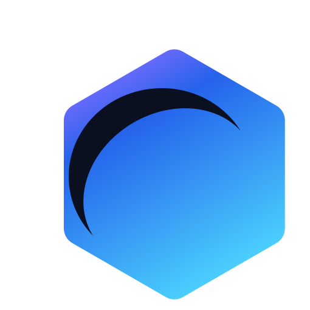

<p align="center">
  
</p>

<h1 align="center">Luna</h1>
<p align="center"><em>Build. Play. Extend.</em></p>

A modular, reusable web game framework built with **Phaser 3**, **TypeScript**, **Fastify**, and **Prisma**.

Luna separates reusable framework code from game-specific code, so you can build multiple games on top of the same core engine without duplicating logic.


---

## Status

🟢 **Phase 1: Planning & Architecture** — complete
🟢 **Phase 2: Framework Foundation** — complete — 11 core managers, 140 unit tests
⚪ **Phase 3: Core Gameplay Systems** — not started

See the [Dev Plan](./docs/DEV_PLAN.md) for the full roadmap.

---

## What's inside

This is a monorepo (npm Workspaces + Turborepo) with two kinds of packages:

| Path | What it is | Status |
|---|---|---|
| `packages/framework/core` | Managers, EventBus, services — the engine's foundation | ✅ 11 managers implemented |
| `packages/framework/physics` | Physics helpers on top of Phaser Arcade / Matter.js | ⏳ placeholder |
| `packages/framework/ui` | HTML5 UI layer (HUD, menus, settings) | ⏳ placeholder |
| `packages/framework/networking` | Multiplayer / API networking abstraction | ⏳ placeholder |
| `packages/framework/utilities` | Stateless helpers shared across packages | ⏳ placeholder |
| `apps/sample-platformer` | A sample game that consumes the framework | ⏳ scaffold only |

The framework packages never depend on any specific game. Games depend on the framework — never the other way around.

### `@luna/core` — implemented managers

| Manager | What it does |
|---|---|
| `Game` | Facade composing every manager below, with a shared update/destroy lifecycle |
| `EventBus` | Pub/sub event system (Observer pattern) — loose coupling between modules |
| `ConfigManager` | Type-safe, generic configuration store |
| `TimeManager` | Frame-independent delta time, with clamping and timeScale (pause/slow-mo) |
| `SceneManager` | Stack-based scene navigation (goto/push/pop/replace) |
| `InputManager` | Action-based input binding (Command pattern) — keyboard adapter included |
| `SaveManager` | Slot-based game saves — LocalStorage and IndexedDB adapters included |
| `AssetManager` | Asset queueing/loading with fallback resolution for missing assets |
| `AudioManager` | Category-based volume control (music/sfx) with master volume and mute |
| `UIBridgeStore` | Reactive state store bridging the Phaser canvas and HTML5 UI |
| `NetworkManager` | HTTP client + WebSocket connection, both fully abstracted from Phaser |

Every manager ships with an interface contract, a framework-agnostic implementation, a thin adapter for the real Phaser/DOM API, and a full unit test suite that runs without a browser.

---

## Getting started

**Requirements:** Node.js 20 LTS or newer.

```bash
git clone https://github.com/p-erdaje/luna-framework.git
cd luna-framework
npm install
```

Run everything:

```bash
npm run dev        # start all dev servers
npm run build       # build all packages
npm run test        # run unit tests
npm run lint         # lint all packages
npm run typecheck   # type-check all packages
```

Turborepo handles the build order automatically — `@luna/core` builds before anything that depends on it.

---

## Project structure

```
apps/
  sample-platformer/     # demo game

packages/
  framework/
    core/
    physics/
    ui/
    networking/
    utilities/

docs/                    # architecture, contributing, roadmap
```

---

## Documentation

- [Architecture](./docs/ARCHITECTURE.md) — layers, patterns, and how modules talk to each other
- [Getting Started](./docs/GETTING_STARTED.md) — local setup in more detail
- [Contributing](./docs/CONTRIBUTING.md) — coding standards, commit conventions, branch rules
- [Dev Plan](./docs/DEV_PLAN.md) — the full technical plan and roadmap
- [Brand](./docs/BRAND.md) — logo, color palette, typography

---

## Engineering principles (short version)

- Framework first — build for reuse before building for one game.
- Composition over inheritance.
- No public API breaks without a migration path.
- Every core system should be testable outside the browser.

Full list in [docs/ARCHITECTURE.md](./docs/ARCHITECTURE.md).

---

## Contributing

This project is in active early development (Phase 3 next). Issues, ideas, and PRs are welcome — see [Contributing](./docs/CONTRIBUTING.md) for coding standards and commit conventions before opening a PR.

---

## License

MIT — see [LICENSE](./LICENSE).
