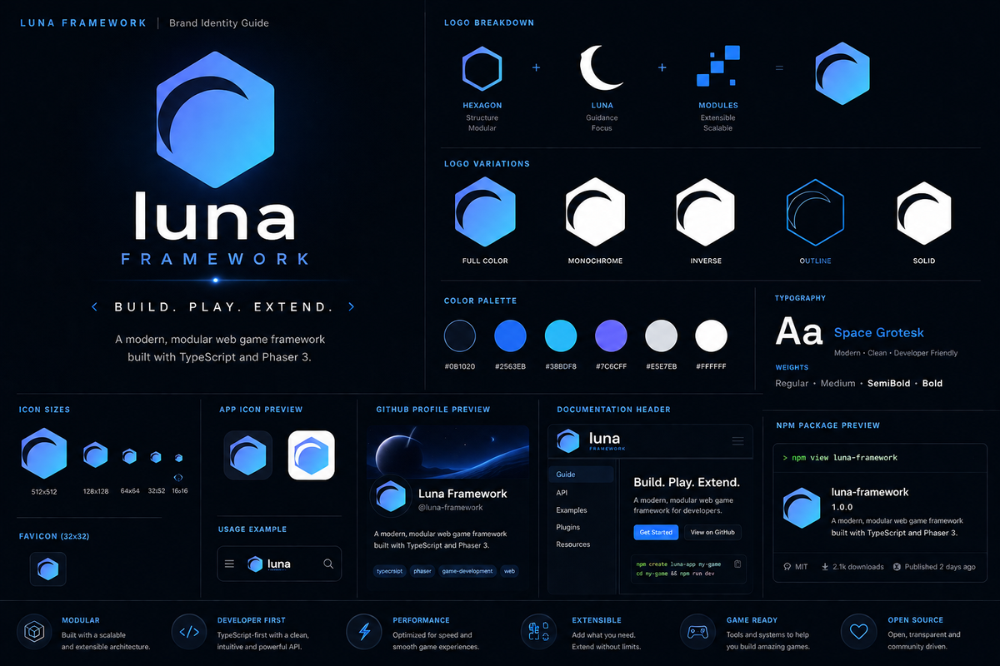

# Brand

Quick reference for Luna's visual identity. For the full breakdown (logo construction, variations, icon sizes, usage previews), see the brand guide image below.

## Logo files

| File | Use |
|---|---|
| `assets/brand/logo-full.svg` | Vector icon mark. Preferred for README/docs headers — scales cleanly at any size, no raster artifacts. Pair with a "Luna" text heading for the full wordmark treatment. |
| `assets/brand/logo-full.png` | Icon + wordmark (raster). Legacy — kept for contexts that don't support SVG (e.g. some npm registry renderers). |
| `assets/brand/icon.png` | Square icon only, no card background. App icons, package registries. |
| `assets/brand/icon-dark.png` | Icon on a dark card. Dark-mode surfaces. |
| `assets/brand/icon-light.png` | Icon on a light card. Light-mode surfaces. |
| `assets/brand/favicon.ico` | Multi-resolution favicon (16/32/48/64px). |

## Color palette

| Color | Hex | Use |
|---|---|---|
| Deep space | `#0B1020` | Backgrounds, dark surfaces |
| Blue | `#2563EB` | Primary brand color |
| Sky | `#38BDF8` | Gradient accent, highlights |
| Cyan | `#4ED9FF` | Gradient accent, brand mark endpoint |
| Violet | `#7C6CFF` | Secondary accent |
| Light gray | `#E5E7EB` | Body text on dark |
| White | `#FFFFFF` | Text on dark, light-mode base |

**Brand mark gradient:** `#7C6CFF` → `#2563EB` (25%) → `#4ED9FF` (100%), diagonal, top-left to bottom-right. Used on the hexagon fill in `assets/brand/logo-full.svg`.

## Typography

**Space Grotesk** — Regular, Medium, SemiBold, Bold. Used for wordmark and headings; modern, clean, developer-friendly.

## Logo construction

Hexagon (structure, modularity) + crescent moon (Luna) + module squares (extensibility) = the mark. Available in full color, monochrome, inverse, outline, and solid variants — see the reference image above for each.

## Tagline

**Build. Play. Extend.**